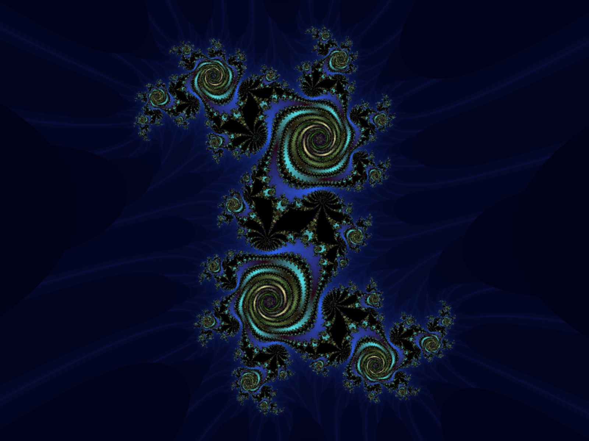

# Fractal

## Introduction

Simple fractal generator.

## Prerequisites

* [The Regina REXX interpreter - regina-rexx version 3.9.3](https://sourceforge.net/projects/regina-rexx/files/regina-rexx/3.9.3/)
  * [development files - libregina3-dev](https://sourceforge.net/projects/regina-rexx/files/regina-rexx/3.9.3/)
* Optional - [Netpbm](http://netpbm.sourceforge.net/)
